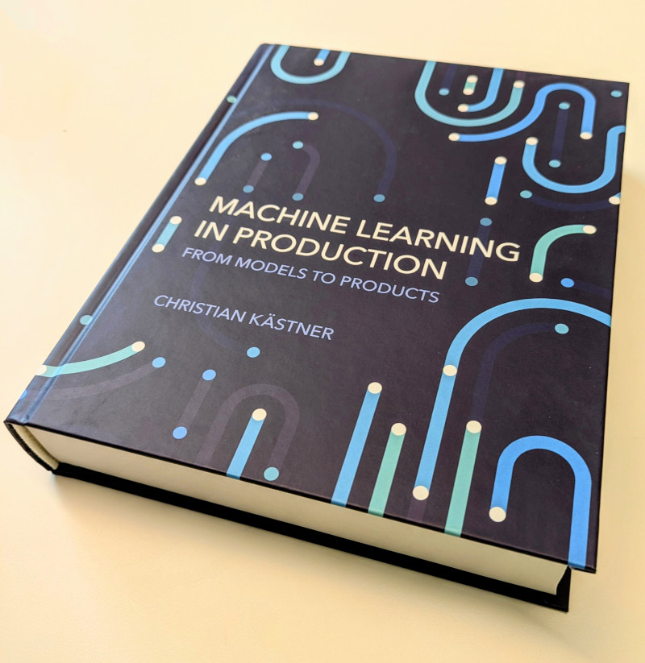

# Machine Learning in Production @ CMU

Find resources related to teaching and research on how to build, deploy, assure, and maintain **software products with machine-learned models**. For example, how to integrate a voice-to-text model and an LLM into a video conferencing product to create automated meeting summaries. We cover the entire lifecycle from a prototype ML model to an entire product deployed in the real world, not just models or notebooks. Covers also the **responsible ML engineering** of such systems (safety, security, fairness, transparency) and **MLOps**. 

All materials (book, slides, assignments, bibliography) are released under creative commons licenses. We hope that this fosters teaching and research on these topics.

Maintained by [Christian Kaestner](https://www.cs.cmu.edu/~ckaestne/).

## The Pitch

The following talk motivates the entire endeavor, explains the need to focus on engineering the entire system, not just the model, and runs through what this means from the lens of quality assurance (model testing to system testing):

<iframe width="560" height="315" src="https://www.youtube-nocookie.com/embed/G-N1iBYYXVo" frameborder="0" allowfullscreen="true"></iframe>

## The Book

<a href="https://mitpress.mit.edu/9780262049726/machine-learning-in-production/" style="color:white">Print & Ebook version</a> <a href="https://mlip-cmu.github.io/book/" style="color:white">Online version</a>

A book has been published MIT Press as open access. All author proceeds are donated to [Evidence Action](https://evidenceaction.org/). The complete book is available online under a creative common license [here](https://mlip-cmu.github.io/book/).

## The Course

<a href="https://mlip-cmu.github.io/s2025/" style="color:white">Spring 2025 website</a>

We teach a 12-unit course at Carnegie Mellon University on this topic, open to undergraduates and graduate students. We expect some minimal machine learning background and some programming skills, but no prior software engineering research. The course is always offered in the spring semester and often also in the fall.

* Spring 2026: [S2026 website](https://mlip-cmu.github.io/s2026/) and [S2026 on GitHub](https://github.com/mlip-cmu/s2026)
* Fall 2025: [F2025 website](https://mlip-cmu.github.io/f2025/) and [F2025 on GitHub](https://github.com/mlip-cmu/f2025)
* Spring 2025: [S2025 website](https://mlip-cmu.github.io/s2025/) and [S2025 on GitHub](https://github.com/mlip-cmu/s2025)
* Fall 2024: [F2024 website](https://mlip-cmu.github.io/f2024/) and [F2024 on GitHub](https://github.com/mlip-cmu/f2024)
* Spring 2024: [S2024 website](https://mlip-cmu.github.io/s2024/) and [S2024 on GitHub](https://github.com/mlip-cmu/s2024)
* Spring 2023: [S2023 website](https://mlip-cmu.github.io/s2023/) and [S2023 on GitHub](https://github.com/mlip-cmu/s2023)
* Fall 2022: [F2022 website](https://ckaestne.github.io/seai/F2022) and [F2022 GitHub branch](https://github.com/ckaestne/seai/tree/F2022)
* Spring 2022: [S2022 website](https://ckaestne.github.io/seai/S2022) and [S2022 GitHub branch](https://github.com/ckaestne/seai/tree/S2022)
* Spring 2021: [S2021 website](https://ckaestne.github.io/seai/S2021) and [S2021 GitHub branch](https://github.com/ckaestne/seai/tree/S2021)
* Fall 2020: [F2020 website](https://ckaestne.github.io/seai/F2020) and [F2020 GitHub branch](https://github.com/ckaestne/seai/tree/F2020)
* Summer 2020 (with video recordings):  [S2020 website](https://ckaestne.github.io/seai/S2020) and [S2020 GitHub branch](https://github.com/ckaestne/seai/tree/S2020)
* Fall 2019: [F2019 website](https://ckaestne.github.io/seai/F2019) and [F2019 GitHub branch](https://github.com/ckaestne/seai/tree/F2019).

For a description of topics covered and course structure, see [learning goals](https://github.com/mlip-cmu/s2024/blob/main/learning_goals.md).

## Annotated Bibliography

<a href="https://github.com/ckaestne/seaibib" style="color:white">Annotated Bibliography</a>

An (opinionated) annotated bibliography of academic papers in this space, covering a wide range of topics from research on testing to requirements to notebooks: [https://github.com/ckaestne/seaibib](https://github.com/ckaestne/seaibib)

## Open-Source ML Products

<a href="https://github.com/mlip-cmu/awesome-ml-products" style="color:white">Awesome ML Products
</a>

A curated set of open source products that use machine learning. These are all end-user products that incorporate machine learning models, not libraries, research prototypes, or notebooks. We hope that this lists facilitates research on building products beyond the model-centric view of analyzing ML components: [https://github.com/mlip-cmu/awesome-ml-products](https://github.com/mlip-cmu/awesome-ml-products). For more applications also see this list of [Open Source Android Apps with LLMs](https://github.com/kimberlyhau/LLM-enabledAndroidAppsReplicationPackage).

## Related Courses at CMU

* 17-649 Artificial Intelligence for Software Engineering: This course focuses on how AI techniques can be used to build better software engineering tools and goes into more depth with regard to specific AI techniques, whereas we focus on how software engineering techniques can be used to build AI-enabled systems. Our application scenarios are typical web-based systems for end users, rather than tools for software developers.
* [05-318 Human-AI Interaction](http://www.humanaiclass.org/): Focuses on the HCI angle on designing AI-enabled products. Overlaps in some coverage on fairness, covers in much more detail user interface design and how to involving humans in ML-supported decisions, whereas this course focuses more on architecture design, requirements engineering, and deploying systems in production. Both courses are complementary.
* [17-646 DevOps: Modern Deployment](https://mse.isri.cmu.edu/applicants/course-offerings.html), [17-647 Engineering Data Intensive Scalable Systems](https://mse.isri.cmu.edu/applicants/course-offerings.html), and similar: These course cover techniques to build scalable, reactive, and reliable systems in depth. We will survey DevOps, and big data systems in the context of designing and deploying systems, but will not explore them in as much detail as a dedicated course can. We will look at MLOps as a ML-specific variant of DevOps.
* [10-601 Machine Learning](https://www.cmu.edu/mits/curriculum/core/10-601.html), [15-381 Artificial Intelligence: Representation and Problem Solving](https://www.cs.cmu.edu/~15381-f17/), [05-834  Applied Machine Learning](https://www.cmu.edu/mits/curriculum/core/05-834.html), [95-865 Unstructured Data Analytics](https://www.andrew.cmu.edu/user/georgech/95-865/), [10-718: Machine Learning in Practice](https://github.com/dssg/MLinPractice), and many others: CMU offers many course that teach how machine learning and artificial intelligence techniques work internally or how to apply them to specific problems (including feature engineering and model evaluation), often on static data sets. We assume a basic understanding of such techniques and processes (see prerequisites) but focus on the engineering process for production ML systems.
* 17-691 Machine Learning in Practice: Applied machine learning with an focus on deployment and monitoring of models.
* [15-884 Machine Learning Systems](https://catalyst.cs.cmu.edu/15-884-mlsys-sp21/), [10-714 Deep Learning Systems](https://dlsyscourse.org): Courses that focus on the systems aspect of building ML libraries, such as distributed learning and using hardware acceleration. 
* [17-630 Prompt Engineering](https://www.cs.cmu.edu/~breaux/prompting/): Course focused specifically on prompt engineering for large language models.
* [10-613 Machine Learning, Ethics and Society](https://www.cs.cmu.edu/~hheidari/mles-fall-21.html), [16-735 Ethics and Robotics](), [05-899 Fairness, Accountability, Transparency, & Ethics (FATE) in Sociotechnical Systems], and others dive much deeper into ethical issues and fairness in machine learning, in some cases diving deeper into statistical notions or policy. We will cover these topics in a two-week segment among many others. 
